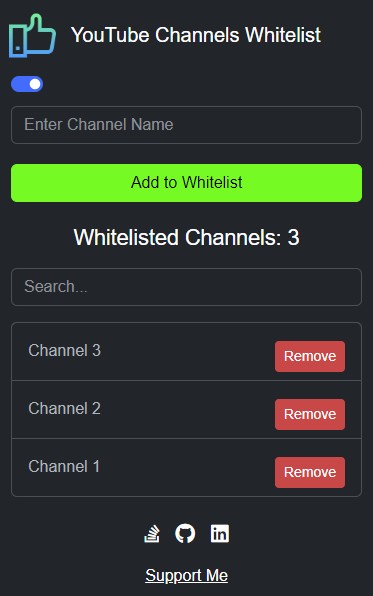
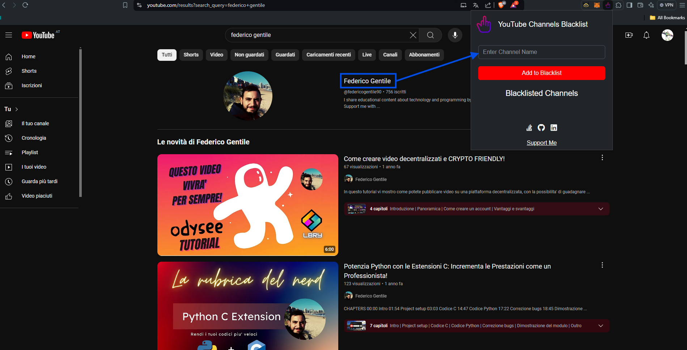
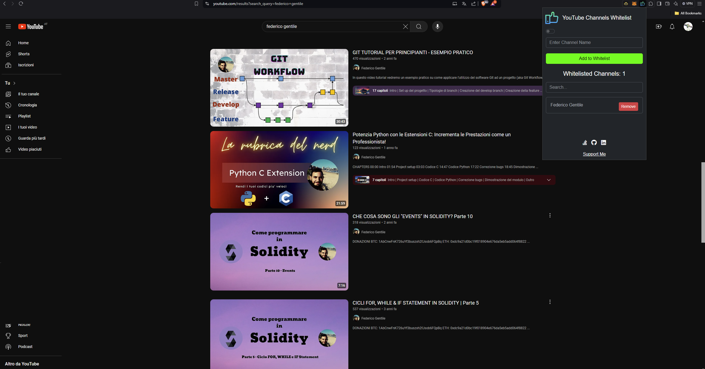
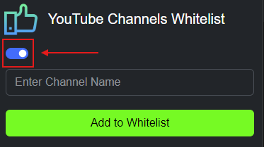

# YouTube Channels Whitelist
Show only whitelisted channels in your YouTube searches.

  

## Where to get it?
Download it from:
- [Chrome Web Store](https://chromewebstore.google.com/)
- [Firefox Browser ADD-ONS](https://addons.mozilla.org/en-US/firefox/extensions/)

## How to use it?
1. Select the name of the channel you want to whitelist:

2. Write the name of the channel in the popup window and click **Add to Whitelist**:

3. Do not forget to active the filter!

4. Click on **Remove** to remove the channel from the whitelist and see the contents again.
